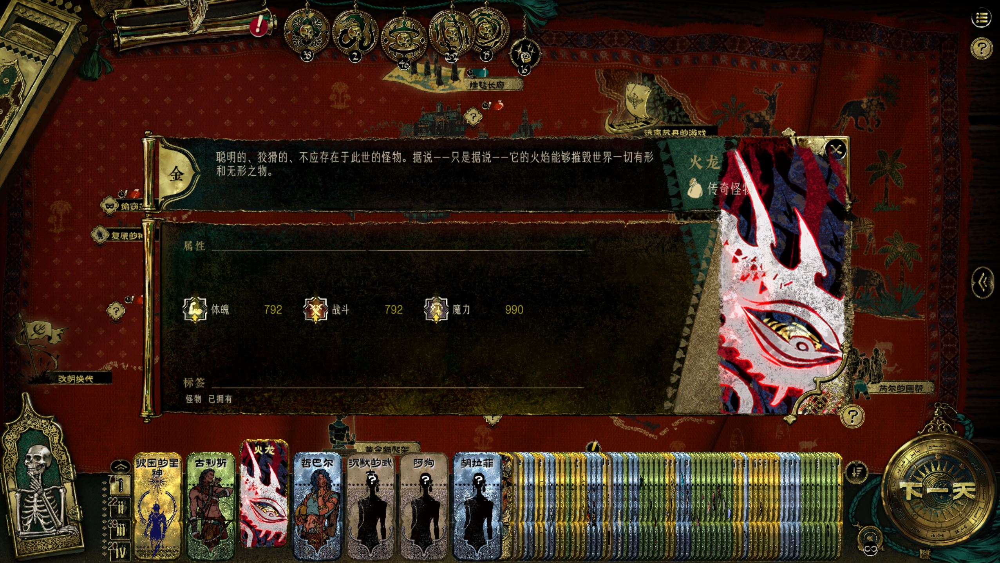
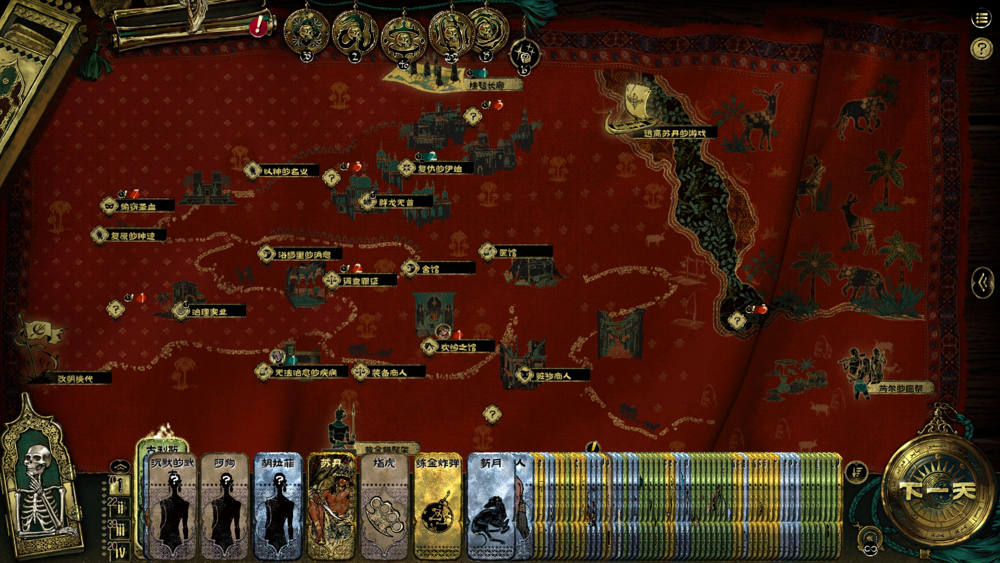
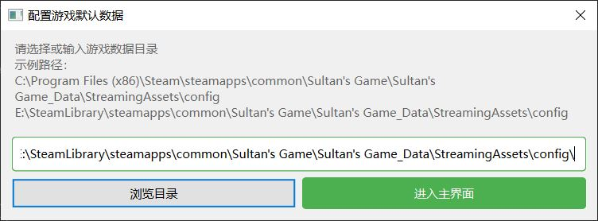
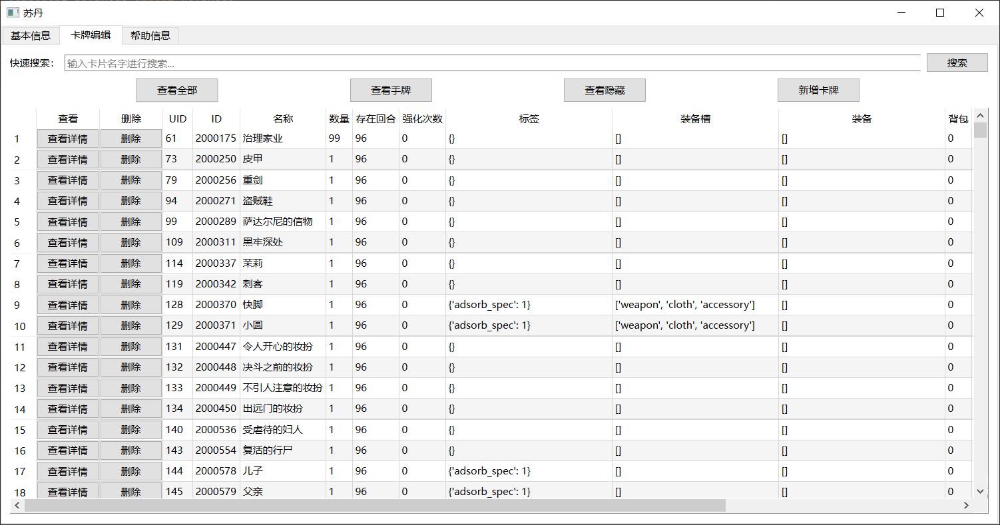
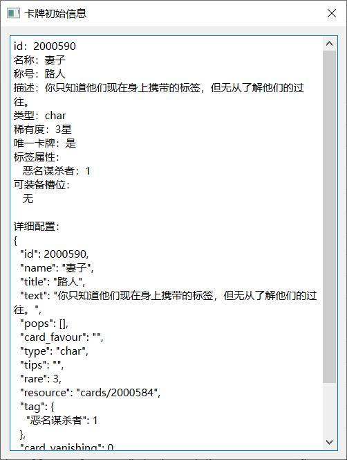
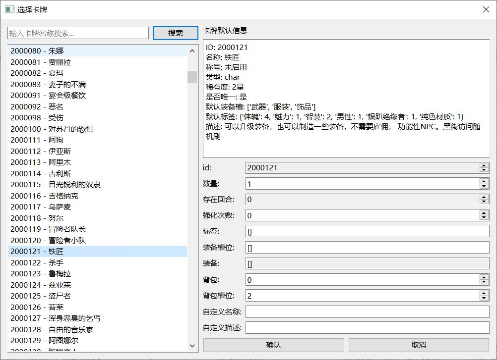

# 苏丹的游戏存档编辑器 v1.0.2
有任何问题欢迎与我联系，欢迎加群讨论，群内会第一时间更新最新版本，QQ群：271892787

## 使用指南
### 软件介绍
- ！！！！！使用前请详细阅读软件使用指南
- 下载 `.zip` 压缩包，解压后双击 `mainWindow.exe` 即可使用 
### 基本功能
1. 选择存档文件，查看基本信息
2. 卡牌编辑界面功能：
    - 展示牌桌上全部卡牌，包括手牌和隐藏的卡牌
    - 使用搜索框快速定位卡牌
    - 点击"新增卡牌"按钮添加新卡牌，在添加装备类卡牌时请设置其标签为 `{'own': 1}`
    - 表格直接编辑修改卡牌属性，修改前请确保您知晓卡牌各属性的格式和内容
    - 点击查看详情按钮查看卡牌的默认信息
    - 点击删除按钮删除对应卡牌
3. 仪式界面功能：
    - 查看当前开启的仪式及仪式详细信息

### 注意事项（仔细阅读）
- 使用本软件前一定备份存档文件
- 默认存档文件路径示例：`C:\Users\25285\AppData\LocalLow\DoubleCross\SultansGame\SAVEDATA\76561199041269113\auto_save.json`
- 在游戏中点击「保存并退出按钮」后再使用本软件修改存档信息，否则游戏内会在存档文件中写入新内容导致您的修改无效
- 修改配置后请及时保存

### bugs/tips
- ​**tip**​：虽然部分卡牌被设置为不可堆叠和唯一，但是依旧可以编辑其数量，只不过游戏会将多张合并为一张，且卡牌属性为多张属性之和
- ​**bug**​：目前软件区分是否为手牌的方式是根据其在背包中的位置，(0,0)和(0,1)位置的卡牌是隐藏卡牌，这就导致真正(0,1)位置的卡牌也被划分为了隐藏
- ​**bug**​：书籍如果被使用依旧会占用背包位置，导致被筛选为手牌中的卡，需要根据其标签中是否存在 `{'own': -1}` 进一步筛选，我这里懒得搞了
- ​**bug**​：如果先搜索了卡牌然后新增卡牌，可能导致页面布局改变，点击手动刷新即可恢复页面布局
- **bug**: 新增装备类卡牌时需要添加{"own":1}的标签，否则不会出现在手牌中
- ​**tip**​：有任何问题欢迎与我联系，欢迎加群讨论，群内会第一时间更新最新版本，QQ群：271892787

---

## 软件界面截图  

  
  

## 版权信息
​**开发者**​：JTBSG  
​**联系方式**​：2528575905@qq.com  
​**版本号**​：1.0.1 (2025-04)  
​**开源协议**​：MIT License